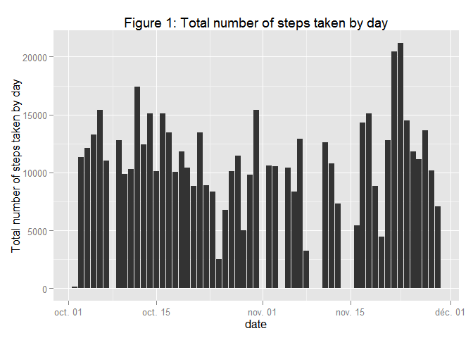
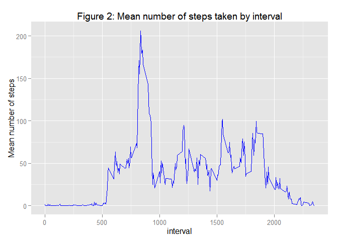
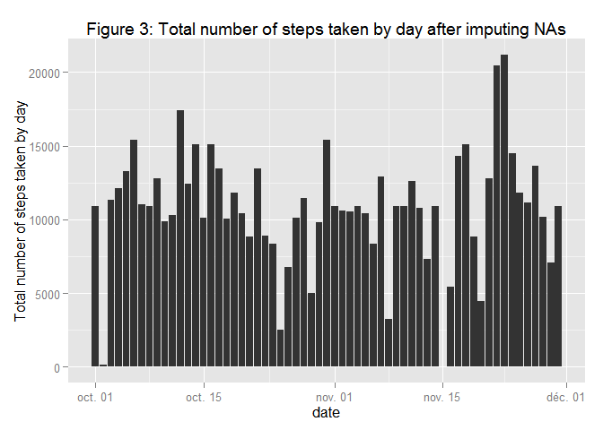
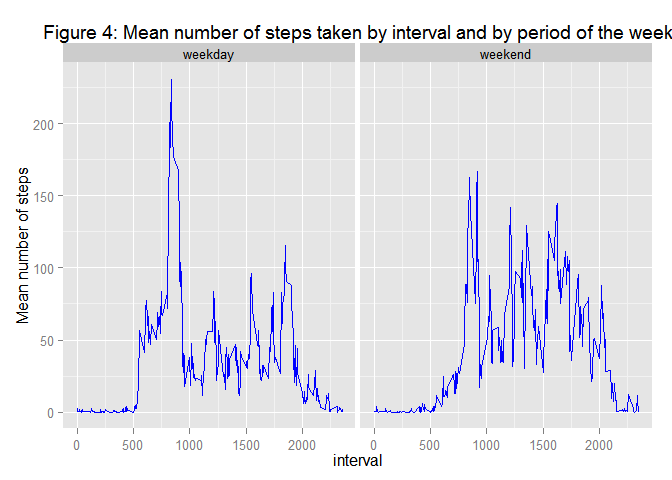

# Reproducible Research: Peer Assessment 1


## Loading and preprocessing the data

```r
#Loading necessary libraries
library(ggplot2)
```

```
## Warning: package 'ggplot2' was built under R version 3.1.2
```

```r
#Reading activity file
activity_data <- read.csv("activity.csv")

#Convert date column to date format
activity_data$date <- as.Date(activity_data$date)
```

## What is mean total number of steps taken per day
1.) Make a histogram of the total number of steps taken each day

```r
#Create a barplot of steps taken by day
qplot(x=date, y=steps, data=activity_data, stat='summary',
                            fun.y=sum, geom='bar') +
  scale_y_continuous("Total number of steps taken by day") +
  ggtitle("Figure 1: Total number of steps taken by day")
```

```
## Warning: Removed 2304 rows containing missing values (stat_summary).
```

 

2.) Calculate and report the mean and median total number of steps taken per day

```r
#Create a dataset containing data agregated by day (sum of steps by date)
activity_byDay <- aggregate(steps ~ date, data=activity_data, FUN=sum)

#Calculate the mean number of steps taken by day
StepsPerDay_mean <- round(mean(activity_byDay$steps), 2)

#Calculate the median number of steps taken by day
StepsPerDay_median <- median(activity_byDay$steps)
```
The mean of the number of steps taken by day is **10766.19**. The median is **10765**.

## What is the average daily activity pattern?
1,) Make a time series plot (i.e. type = "l") of the 5-minute interval (x-axis) and the average number of steps taken, averaged across all days (y-axis)

```r
activity_byInterval <- aggregate(steps ~ interval, data=activity_data, 
                                 FUN=mean)

ggplot(data=activity_byInterval, aes(x=interval, y=steps)) +
  geom_line(color="blue") +
  scale_y_continuous("Mean number of steps") +
  ggtitle("Figure 2: Mean number of steps taken by interval")
```

 

2.) Which 5-minute interval, on average across all the days in the dataset, contains the maximum number of steps?

```r
#Get the "interval" value of the interval that has the max steps value
max_steps_interval <- activity_byInterval[
  which(activity_byInterval$steps==max(activity_byInterval$steps)),"interval"]
```
The interval with the most steps in it is **835**.

## Imputing missing values
1.) Calculate and report the total number of missing values in the dataset (i.e. the total number of rows with NAs)

```r
#Compute the sum of NA values
sum(is.na(activity_data))
```

```
## [1] 2304
```

2.) Devise a strategy for filling in all of the missing values in the dataset. The strategy does not need to be sophisticated. For example, you could use the mean/median for that day, or the mean for that 5-minute interval, etc.

As a strategy for filling in all od the missing values, I'll use the **mean** value of the same 5-minutes interval.

3.) Create a new dataset that is equal to the original dataset but with the missing data filled in. I will round them to the next whole number.


```r
# Use the means we calculated previously
activity_byInterval$na_steps <- ceiling(activity_byInterval$steps)

# Merge the activity dataset with the interval one by interval
complete_activity_data <- merge(activity_data,
                          activity_byInterval[,c('interval', 'na_steps')],
                          by='interval')

# Replace the missing values
complete_activity_data$steps <- ifelse(is.na(complete_activity_data$steps),
                                 complete_activity_data$na_steps,
                                 complete_activity_data$steps)

# Remove the last column
complete_activity_data <- complete_activity_data[, !(colnames(
  complete_activity_data) %in% c("na_steps"))]
```
4.) Make a histogram of the total number of steps taken each day and Calculate and report the mean and median total number of steps taken per day. Do these values differ from the estimates from the first part of the assignment? What is the impact of imputing missing data on the estimates of the total daily number of steps?


```r
qplot(x=date, y=steps, data=complete_activity_data, stat='summary',
                            fun.y=sum, geom='bar') +
  scale_y_continuous("Total number of steps taken by day") +
  ggtitle("Figure 3: Total number of steps taken by day after imputing NAs")
```

 

```r
#Create a dataset containing data agregated by day (sum of steps by date)
complete_activity_byDay <- aggregate(steps ~ date, data=complete_activity_data, FUN=sum)

#Calculate the mean number of steps taken by day
complete_stepsPerDay_mean <- round(mean(complete_activity_byDay$steps), 2)

#Calculate the median number of steps taken by day
complete_stepsPerDay_median <- median(complete_activity_byDay$steps)
```

There's some difference between now and before we filled all the NAs. The mean changed from 10766.19 to **10784.92** and the median from 10765 to **10909**.

## Are there differences in activity patterns between weekdays and weekends?

1.) Create a new factor variable in the dataset with two levels – “weekday” and “weekend” indicating whether a given date is a weekday or weekend day.

```r
#function translating weekday's name to "weekday" or "weekend"
day_period <- function(date) {
    if (weekdays(as.Date(date)) %in% c("samedi", "dimanche")) {
        "weekend"
    } else {
        "weekday"
    }
}

#Add column "day_period" to complete activity dataset
complete_activity_data$day_period <- as.factor(
  sapply(complete_activity_data$date, day_period))
```

2.) Make a panel plot containing a time series plot (i.e. type = "l") of the 5-minute interval (x-axis) and the average number of steps taken, averaged across all weekday days or weekend days (y-axis). See the README file in the GitHub repository to see an example of what this plot should look like using simulated data.


```r
complete_activity_byInterval <- aggregate(steps ~ interval+day_period, 
                                          data=complete_activity_data, 
                                 FUN=mean)

ggplot(data=complete_activity_byInterval, aes(x=interval, y=steps))+
  geom_line(color="blue") +
  facet_wrap(~day_period)+
  scale_y_continuous("Mean number of steps") +
  ggtitle("Figure 4: Mean number of steps taken by interval and by period of the week")
```

 
